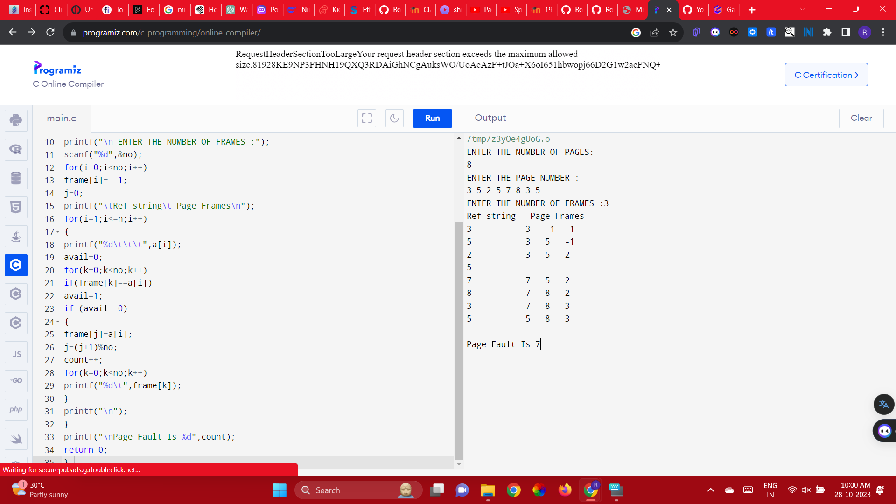

# OS-EX.10-IMPLEMENTATION-OF-PAGE-REPLACEMENT-ALGORITHMS

## AIM:

To write a C program to implement Page Replacement technique using FIFO 

## ALGORITHM:

1. Start the program.
2. Get the number of pages and their sequence from the user.
3. Get the number of available page frames from the user.
4. In FIFO, on the basics of first in first out, replace the pages respectively, then
find number of page faults occurred.
5. Compare all frames with incoming page6. If the incoming page is already available in page frame, set the match flag to
indicate ‘no need of page replacement’.
7. If the incoming page is not available in all frames, then remove the page
which is loaded into the memory long back and give space for new incoming
page.
8. Increment the ‘number of Page faults counter.
9. Print the number of page faults.
10. Stop the program. 

## PROGRAM:

```
#include<stdio.h>
int main()
{
int i,j,n,a[50],frame[10],no,k,avail,count=0;
printf("\n ENTER THE NUMBER OF PAGES:\n");
scanf("%d",&n);
printf("\n ENTER THE PAGE NUMBER :\n");
for(i=1;i<=n;i++)
scanf("%d",&a[i]);
printf("\n ENTER THE NUMBER OF FRAMES :");
scanf("%d",&no);
for(i=0;i<no;i++)
frame[i]= -1;
j=0;
printf("\tRef string\t Page Frames\n");
for(i=1;i<=n;i++)
{
printf("%d\t\t\t",a[i]);
avail=0;
for(k=0;k<no;k++)
if(frame[k]==a[i])
avail=1;
if (avail==0)
{
frame[j]=a[i];
j=(j+1)%no;
count++;
for(k=0;k<no;k++)
printf("%d\t",frame[k]);
}
printf("\n");
}
printf("\nPage Fault Is %d",count);
return 0;
} 
```

## OUTPUT:



## RESULT:

Thus the implementation of FIFO page replacement is successfully executed. 
